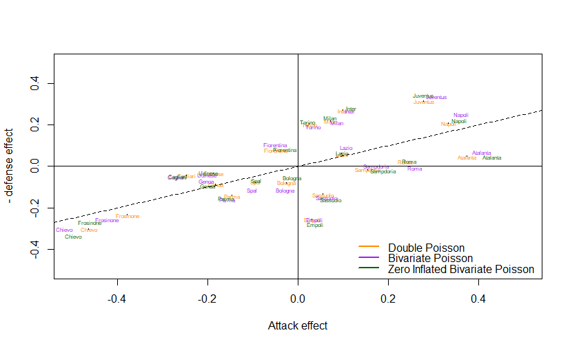
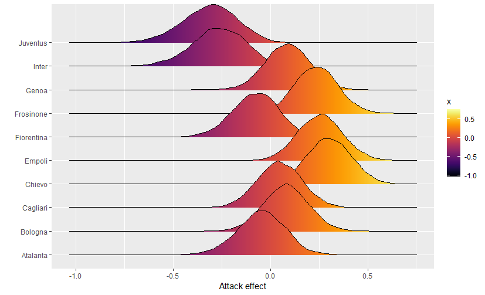
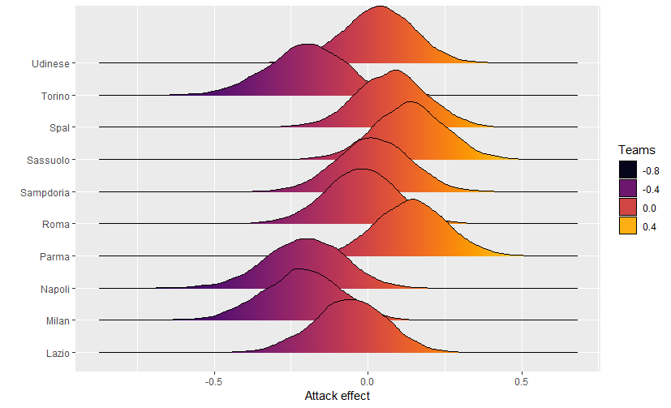

# Bayesian Inference for Football Match Prediction

## Project Overview
This project applies Bayesian inference techniques to predict the number of goals scored by football teams in Serie A matches during the 2018-2019 season. The dataset contains match results between 20 teams, resulting in a total of 380 matches. Each row in the dataset provides the following information:

- **HomeTeam**: The name of the home team
- **AwayTeam**: The name of the away team
- **FTHG**: Full-time goals scored by the home team
- **FTAG**: Full-time goals scored by the away team

The objective is to model the number of goals scored by each team using the following probabilistic methods:

1. Double Poisson (Independent Components)
2. Bivariate Poisson
3. Zero-Inflated Bivariate Poisson

Additionally, each team's attack and defense ability are estimated using Normal distributions. These factors contribute to the prediction of match outcomes.

## Dataset
The dataset is supplied by Datahub and includes match data for the 2018-2019 Serie A season. Each week, 10 matches were played, totaling 380 matches for the season.

Sample data:

| HomeTeam  | AwayTeam  | FTHG | FTAG |
| --------- | --------- | ---- | ---- |
| Chievo    | Juventus  | 2    | 3    |
| Lazio     | Napoli    | 1    | 2    |
| Bologna   | Spal      | 0    | 1    |
| Empoli    | Cagliari  | 2    | 0    |
| Parma     | Udinese   | 2    | 2    |
| Sassuolo  | Inter     | 1    | 0    |

## Goals
The main goals of the project are:

- To understand the scoring behavior of teams using different probabilistic models.
- To estimate team-specific parameters (attack and defense abilities).
- To predict the number of goals in upcoming matches based on the models.

## Comparison of attack and defense effects between models

## Distribution of attack effects

